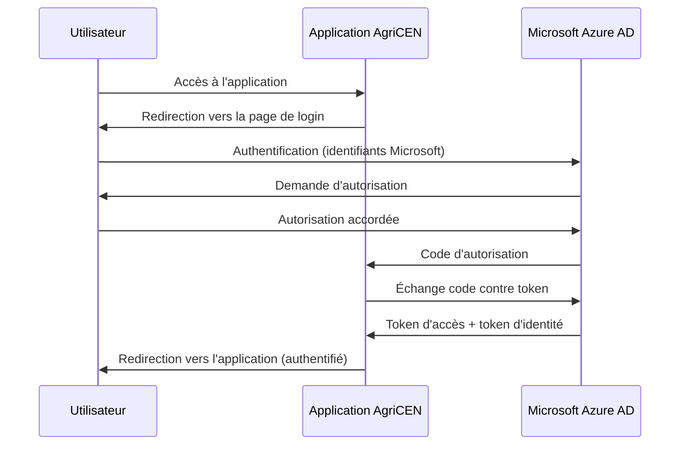

# Authentification

AgriCEN utilise l'authentification Microsoft Entra ID pour sécuriser l'accès à l'application. Cette méthode offre une sécurité robuste et facile l'accès utilisateur (connexion unique à leur session M365 le matin par exemple)

## Architecture d'authentification

Le système d'authentification est basé sur le protocole OAuth 2.0 et OpenID Connect, avec Microsoft Identity Platform comme fournisseur d'identité :



## Implémentation

L'authentification est implémentée à l'aide des bibliothèques suivantes :

- **MSAL** (Microsoft Authentication Library) : Pour l'interaction avec Microsoft Entra ID
- **Flask-Login** : Pour la gestion des sessions utilisateurs authentifiés

### Configuration Microsoft Entra ID

Pour fonctionner, l'application doit être enregistrée dans Microsoft Entra ID avec les paramètres suivants :

```python
# Extrait de config.py
CLIENT_ID = 'votre-client-id'
CLIENT_SECRET = 'votre-client-secret'
AZURE_TENANT_ID = 'votre-tenant-id'
AUTHORITY = f"https://login.microsoftonline.com/{AZURE_TENANT_ID}"
SCOPE = ['User.Read']
```

### Classe User

La classe `User` implémente l'interface requise par Flask-Login et gère les informations de l'utilisateur :

```python
class User(UserMixin):
    def __init__(self, id, name, email, token=None):
        self.id = id
        self.name = name
        self.email = email
        self.token = token

    @staticmethod
    def get_user_from_token(token):
        """Récupère les informations de l'utilisateur à partir du token"""
        graph_data = requests.get(
            'https://graph.microsoft.com/v1.0/me',
            headers={'Authorization': f'Bearer {token}'},
        ).json()
        
        return User(
            id=graph_data.get('id'),
            name=graph_data.get('displayName'),
            email=graph_data.get('userPrincipalName'),
            token=token
        )
```

### Fonctions d'authentification

Le fichier `auth.py` contient les fonctions principales pour l'authentification :

#### Construction de l'application MSAL

```python
def _build_msal_app(cache=None):
    """Construit l'application MSAL pour l'authentification"""
    return msal.ConfidentialClientApplication(
        Config.CLIENT_ID,
        authority=Config.AUTHORITY,
        client_credential=Config.CLIENT_SECRET,
        token_cache=cache
    )
```

#### Construction de l'URL d'authentification

```python
def _build_auth_url(authority=None, scopes=None, state=None):
    """Construit l'URL d'authentification"""
    return _build_msal_app().get_authorization_request_url(
        scopes or Config.SCOPE,
        state=state or str(uuid.uuid4()),
        redirect_uri=url_for('auth_callback', _external=True, _scheme='https')
    )
```

#### Récupération du token

```python
def _get_token_from_code(code):
    """Récupère le token à partir du code d'autorisation"""
    result = _build_msal_app().acquire_token_by_authorization_code(
        code,
        scopes=Config.SCOPE,
        redirect_uri=url_for('auth_callback', _external=True, _scheme='https')
    )
    return result
```

## Routes d'authentification

Les routes suivantes sont définies pour gérer le processus d'authentification :

### Page de connexion

```python
@app.route('/login')
def login():
    """Page de connexion"""
    if current_user.is_authenticated:
        return redirect(url_for('map_page'))
    
    # Génère l'URL d'authentification Microsoft
    auth_url = _build_auth_url()
    return render_template('login.html', auth_url=auth_url)
```

### Callback d'authentification

```python
@app.route('/auth/callback')
def auth_callback():
    """Callback après authentification Microsoft"""
    if request.args.get('error'):
        flash(f"Erreur lors de l'authentification: {request.args.get('error_description')}", 'danger')
        return redirect(url_for('login'))
    
    if request.args.get('code'):
        # Récupère le token à partir du code
        result = _get_token_from_code(request.args.get('code'))
        
        if 'error' in result:
            flash(f"Erreur lors de l'authentification: {result.get('error_description')}", 'danger')
            return redirect(url_for('login'))
        
        # Récupère les informations de l'utilisateur
        token = result.get('access_token')
        user = User.get_user_from_token(token)
        
        # Sauvegarde l'utilisateur dans la session
        session['user'] = {
            'id': user.id,
            'name': user.name,
            'email': user.email,
            'token': token
        }
        
        # Connecte l'utilisateur
        login_user(user)
        
        # Redirige vers la page demandée ou la page d'accueil
        next_page = session.get('next', url_for('map_page'))
        session.pop('next', None)
        return redirect(next_page)
    
    return redirect(url_for('login'))
```

### Déconnexion

```python
@app.route('/logout')
def logout():
    """Déconnexion"""
    logout_user()
    session.clear()
    return redirect(url_for('login'))
```

## Protection des routes

Les routes qui nécessitent une authentification sont protégées par le décorateur `@login_required` :

```python
@app.route('/map_page')
@login_required
def map_page():
    # Contenu accessible uniquement aux utilisateurs connectés
    pass
```

Si un utilisateur non authentifié tente d'accéder à une route protégée, il est automatiquement redirigé vers la page de connexion.


## Sécurité

Mesures de sécurité mises en place :

- **HTTPS obligatoire** 
- **Timeout des sessions** configuré pour déconnecter automatiquement les utilisateurs inactifs au bout de 2h
- **Stockage sécurisé** des informations de session côté serveur
- **Validation des tokens** par l'API Graph Microsoft
