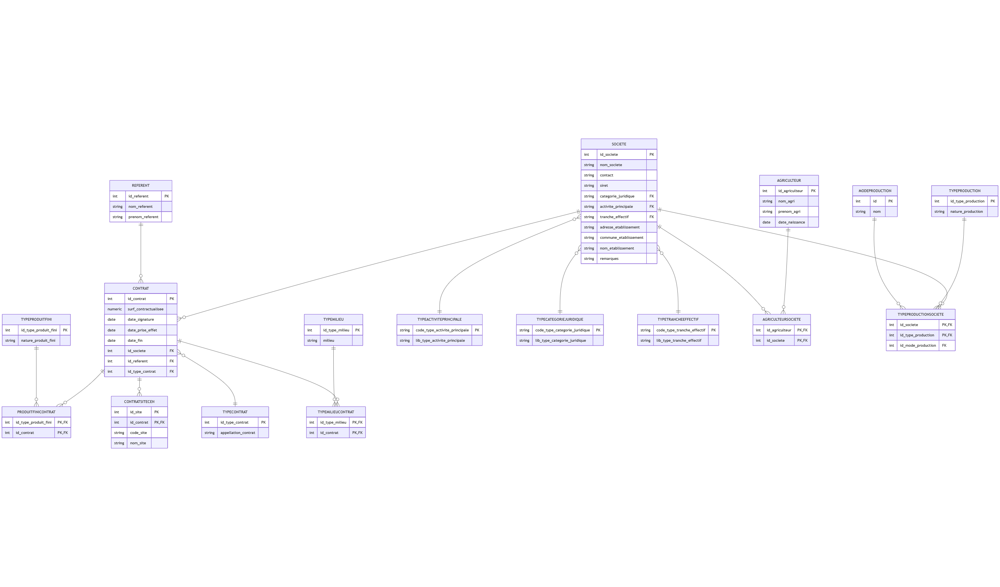

# Modèle de données

Le modèle de données d'AgriCEN est conçu pour représenter efficacement les relations entre les sites naturels, les contrats agricoles, les agriculteurs et les sociétés. L'application utilise SQLAlchemy comme ORM (Object-Relational Mapping) pour interagir avec la base de données PostgreSQL.

## Diagramme entité-relation



## Structure de la base de données

La base de données est organisée en deux schémas principaux :

1. **saisie** : Contient les tables de données opérationnelles
2. **referentiel** : Contient les tables de référence (valeurs fixes)

### Tables principales

#### Agriculteur

```python
class Agriculteur(db.Model):
    __tablename__ = 'agriculteur'
    __table_args__ = {'schema': 'saisie'}
    id_agriculteur = db.Column(db.Integer, primary_key=True)
    nom_agri = db.Column(db.String(100), nullable=False)
    prenom_agri = db.Column(db.String(50), nullable=False)
    date_naissance = db.Column(db.Date)
```

Cette table enregistre les informations des agriculteurs individuels.

#### Societe

```python
class Societe(db.Model):
    __tablename__ = 'societe'
    __table_args__ = {'schema': 'saisie'}
    id_societe = db.Column(db.Integer, primary_key=True)
    nom_societe = db.Column(db.String(100))
    contact = db.Column(db.String(100), nullable=False)
    siret = db.Column(db.String(14), unique=True)
    categorie_juridique = db.Column(db.String(4), db.ForeignKey('referentiel.type_categorie_juridique.code_type_categorie_juridique'))
    activite_principale = db.Column(db.String(6), db.ForeignKey('referentiel.type_activite_principale.code_type_activite_principale'))
    tranche_effectif = db.Column(db.String(2), db.ForeignKey('referentiel.type_tranche_effectif.code_type_tranche_effectif'))
    adresse_etablissement = db.Column(db.String(150))
    commune_etablissement = db.Column(db.String(150))
    nom_etablissement = db.Column(db.String(150))
    remarques = db.Column(db.String(300))
```

Cette table stocke les informations des sociétés/exploitations agricoles.

#### Contrat

```python
class Contrat(db.Model):
    __tablename__ = 'contrat'
    __table_args__ = {'schema': 'saisie'}
    id_contrat = db.Column(db.Integer, primary_key=True)
    surf_contractualisee = db.Column(db.Numeric(4, 2))
    date_signature = db.Column(db.Date)
    id_type_contrat = db.Column(db.Integer, db.ForeignKey('referentiel.type_contrat.id_type_contrat'))
    id_societe = db.Column(db.Integer, db.ForeignKey('saisie.societe.id_societe'))
    id_referent = db.Column(db.Integer, db.ForeignKey('saisie.referent.id_referent'))
```

Table centrale qui représente les contrats agricoles avec leurs caractéristiques.

### Tables d'association

#### AgriculteurSociete

```python
class AgriculteurSociete(db.Model):
    __tablename__ = 'agriculteur_societe'
    __table_args__ = {'schema': 'saisie'}
    id_agriculteur = db.Column(db.Integer, db.ForeignKey('saisie.agriculteur.id_agriculteur'), primary_key=True)
    id_societe = db.Column(db.Integer, db.ForeignKey('saisie.societe.id_societe'), primary_key=True)
```

Table d'association pour la relation many-to-many entre agriculteurs et sociétés.

#### TypeProductionSociete

```python
class TypeProductionSociete(db.Model):
    __tablename__ = 'type_production_societe'
    __table_args__ = {'schema': 'saisie'}
    id_societe = db.Column(db.Integer, db.ForeignKey('saisie.societe.id_societe'), primary_key=True)
    id_type_production = db.Column(db.Integer, db.ForeignKey('referentiel.type_production.id_type_production'), primary_key=True)
    id_mode_production = db.Column(db.Integer, db.ForeignKey('referentiel.mode_production.id'))
```

Association entre une société et ses types de production, avec le mode de production associé.

#### ProduitFiniContrat

```python
class ProduitFiniContrat(db.Model):
    __tablename__ = 'produit_fini_contrat'
    __table_args__ = {'schema': 'saisie'}
    id_type_produit_fini = db.Column(db.Integer, db.ForeignKey('referentiel.type_produit_fini.id_type_produit_fini'), primary_key=True)
    id_contrat = db.Column(db.Integer, db.ForeignKey('saisie.contrat.id_contrat'), primary_key=True)
```

Association entre un contrat et les produits finis résultant de l'activité.

#### TypeMilieuContrat

```python
class TypeMilieuContrat(db.Model):
    __tablename__ = 'type_milieu_contrat'
    __table_args__ = {'schema': 'saisie'}
    id_type_milieu = db.Column(db.Integer, db.ForeignKey('referentiel.type_milieu.id_type_milieu'), primary_key=True)
    id_contrat = db.Column(db.Integer, db.ForeignKey('saisie.contrat.id_contrat'), primary_key=True)
```

Association entre un contrat et les types de milieux concernés.

#### ContratSiteCEN

```python
class ContratSiteCEN(db.Model):
    __tablename__ = 'contrat_site_cen'
    __table_args__ = {'schema': 'saisie'}
    id_site = db.Column(db.Integer, primary_key=True)
    id_contrat = db.Column(db.Integer, db.ForeignKey('saisie.contrat.id_contrat'), primary_key=True)
    code_site = db.Column(db.String(25))
    nom_site = db.Column(db.String(250))
```

Association entre un contrat et un site CEN, avec les informations du site.

### Tables de référence

#### TypeContrat

```python
class TypeContrat(db.Model):
    __tablename__ = 'type_contrat'
    __table_args__ = {'schema': 'referentiel'}
    id_type_contrat = db.Column(db.Integer, primary_key=True)
    appellation_contrat = db.Column(db.String(100), nullable=False)
```

Définit les différents types de contrats possibles.

#### TypeProduction

```python
class TypeProduction(db.Model):
    __tablename__ = 'type_production'
    __table_args__ = {'schema': 'referentiel'}
    id_type_production = db.Column(db.Integer, primary_key=True)
    nature_production = db.Column(db.String(50))
```

Liste des types de production agricole.

#### ModeProduction

```python
class ModeProduction(db.Model):
    __tablename__ = 'mode_production'
    __table_args__ = {'schema': 'referentiel'}
    id = db.Column(db.Integer, primary_key=True, autoincrement=True)
    nom = db.Column(db.String(50), unique=True, nullable=False)
```

Modes de production (conventionnel, biologique, etc.).

#### TypeMilieu

```python
class TypeMilieu(db.Model):
    __tablename__ = 'type_milieu'
    __table_args__ = {'schema': 'referentiel'}
    id_type_milieu = db.Column(db.Integer, primary_key=True)
    milieu = db.Column(db.String(100))
```

Types de milieux naturels.

### Vue spatiale

```python
class VueSites(db.Model):
    __bind_key__ = 'secondary'  # Associe ce modèle à la base secondaire
    __tablename__ = 'site_geojson'
    __table_args__ = {'schema': 'saisie'}  
    
    idsite = db.Column(db.Integer, primary_key=True)
    codesite = db.Column(db.String(10))
    nom_site = db.Column(db.String(150))
    geom = db.Column(Geometry('MultiPolygon'))
```

Vue spéciale qui représente les sites avec leur géométrie spatiale.

## Relations et contraintes

Le modèle implémente plusieurs types de relations :

- **One-to-Many** : Un référent peut superviser plusieurs contrats
- **Many-to-Many** : Un contrat peut concerner plusieurs types de milieux
- **Many-to-Many avec attributs** : Une société peut avoir plusieurs types de production, chacun avec un mode de production associé

Des contraintes sont appliquées au niveau de la base de données :

- **Clés étrangères** : Garantissent l'intégrité référentielle
- **Contraintes uniques** : Par exemple, le SIRET unique pour une société

## Utilisation de GeoAlchemy2

L'extension GeoAlchemy2 permet de travailler avec les données spatiales :

```python
from geoalchemy2 import Geometry
from shapely.geometry import mapping
from geoalchemy2.shape import to_shape

# Définition d'une colonne spatiale
geom = db.Column(Geometry('MultiPolygon'))

# Conversion entre PostGIS et GeoJSON
shape = to_shape(site.geom)
geojson = mapping(shape)
```

Elle permet d'afficher les sites CEN sur la carte Leaflet.
